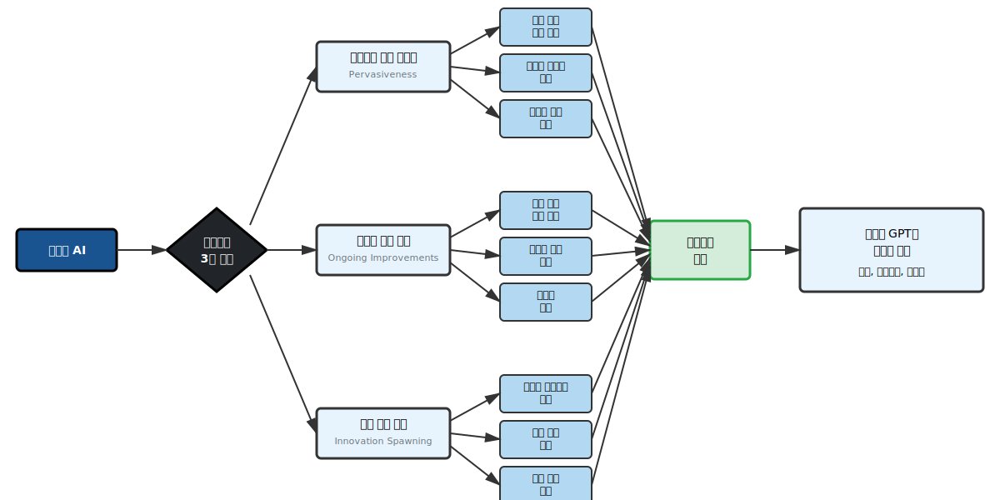

# CLAUDE.md

This file provides guidance to Claude Code (claude.ai/code) when working with code in this repository.

## Project Overview

This is a Korean-language Quarto book project titled "AI가 밝혀낸 유통 고수요 데이터의 진실" focusing on AI and data science with ChatGPT. The book targets Korean audiences with three progressive parts: basic knowledge, AI coding techniques, and real-world case studies.

## Build and Development Commands

### Core Rendering Commands
- **Build entire book**: `quarto render` (outputs to `docs/`)
- **Preview with live reload**: `quarto preview` (port 7771, browser disabled)
- **Build Korean PDF**: `quarto render --to bitPublish-pdf`
- **Single chapter**: `quarto render [chapter].qmd`

### Freeze Cache Management
- **Clear all freeze cache**: `quarto clean --freeze`
- **Force rebuild chapter**: `rm -rf _freeze/[chapter-name]/` then render
- **Check freeze status**: `quarto inspect freeze`

### Validation and Testing
- **Check project structure**: `quarto check`
- **Validate extensions**: `quarto list extensions`
- **Preview specific format**: `quarto preview --to html`

## High-Level Architecture

### Dual-Language Execution Environment
The project uses both R (knitr) and Python (pandas_env kernel) for computational content. Chapters with heavy computation are auto-frozen to ensure reproducible builds without re-execution.

**Key computational chapters**: `coding_openai.qmd` (1,284 lines), `coding_ide.qmd` (1,415 lines), `basic_gpt.qmd` (635 lines).

### Interactive Code Execution System
Three parallel systems enable in-browser code execution:
- **WebR**: R code execution via `{webr-r}` code blocks
- **Pyodide**: Python execution via `{pyodide-python}` blocks
- **Shinylive**: Interactive Shiny apps via `{shinylive-r}` blocks

### Multi-Format Publishing Pipeline
- **HTML**: Primary output with interactive features enabled
- **PDF**: Korean-optimized via `bitPublish` extension with custom fonts
- **Resources**: Audio files (MP3/WAV) automatically included

### Extension Architecture
10 extensions provide core functionality:
- `bit2r/bitPublish`: Korean PDF typesetting
- `coatless/webr`, `coatless-quarto/pyodide`: Interactive execution
- `quarto-ext/shinylive`: Interactive Shiny applications
- `debruine/glossary`: Terminology management
- `sellorm/social-embeds`: Social media integration

## Content Organization and Workflow

### Chapter Structure
Three-part progression with specific content types:
- **Part 1** (basic_*.qmd): Conceptual foundations, minimal computation
- **Part 2** (coding_*.qmd): Heavy computational content, requires freeze management
- **Part 3** (proj_*.qmd): Case studies with real datasets from `/data/`

### Adding New Chapters
1. Create `.qmd` file following naming convention
2. Add to `_quarto.yml` chapters section under appropriate part
3. For computational content, ensure first render to establish freeze cache
4. Use Korean section headers and maintain lang consistency

### Data and Resource Management
- **Large datasets**: Store in `/data/`, reference via relative paths
- **Audio resources**: Automatically included via `resources` config
- **Images**: Store in `/images/`, use for both HTML and PDF outputs
- **Cache**: Computational results cached in `_freeze/` - commit when results change

## Korean Localization Requirements

### Language Configuration
- Primary language: `ko-KR` with custom date formatting
- Section titles use Korean terms ("초록", "참고문헌")
- Cross-references configured with empty prefixes for Korean style

### Typography and Branding
- Font stack: Noto Sans KR (headings), Noto Serif KR (body)
- Brand colors defined in `_brand.yml` (blue primary: #2780e3)
- Footer includes Korean R Users Group attribution

## Development Considerations

### Performance and Optimization
- Preview port 7771 configured to avoid conflicts
- Browser auto-open disabled for development workflow
- Freeze system prevents unnecessary re-computation of heavy chapters
- Lightbox enabled for enhanced image viewing

### Git Workflow
- Main branch deployment, no feature branching currently
- Exclude `_freeze/` from frequent commits unless computational results change
- Include rendered `docs/` for GitHub Pages deployment

### Troubleshooting Common Issues
- **Freeze errors**: Clear specific chapter cache and re-render
- **Extension conflicts**: Check extension compatibility in `_quarto.yml`
- **Korean font issues**: Ensure proper font installation for PDF output
- **Large file handling**: Use Git LFS for datasets over 100MB

### R

#### 코딩 스타일
- **tidyverse 스타일**: 모든 R 코드는 tidyverse 원칙을 따름
- **표 생성**: gt 패키지 사용
  - `cols_width()`: 컬럼 너비는 pct() 함수로 퍼센트 지정
  - `tab_options(table.width = pct())`: 테이블 전체 너비도 퍼센트로 설정
  - **title, subtitle 사용 금지**: Quarto의 `#| tbl-cap`으로 캡션 관리
- **그래프**: ggplot2 사용
- **폰트 관리**: sysfonts, ragg, rsvg 패키지 조합 사용
  - Apple Gothic 폰트를 모든 theme, geom_text 등에 적용
  - `library(sysfonts)`, `library(ragg)`, `library(rsvg)` 사용
  - knitr 그래픽 디바이스를 ragg_png로 설정

#### 예시 코드
```r
# 폰트 설정
library(sysfonts)
library(ragg)
library(rsvg)

# 폰트 등록
sysfonts::font_add("Apple Gothic", "/System/Library/Fonts/AppleGothic.ttf")

# knitr 그래픽 디바이스 설정
knitr::opts_chunk$set(
  dev = "ragg_png",
  dpi = 300,
  fig.retina = 2
)

# gt 테이블 - 기본 템플릿
data %>%
  gt() %>%
  # 컬럼 너비 (퍼센트)
  cols_width(
    컬럼1 ~ pct(20),
    컬럼2 ~ pct(30),
    컬럼3 ~ pct(50)
  ) %>%
  # 테이블 전체 옵션 (_brand.yml 색상 사용)
  tab_options(
    table.width = pct(100),
    table.font.size = px(14),
    table.border.top.style = "solid",
    table.border.top.width = px(2),
    table.border.top.color = "#2780e3",        # blue
    table.border.bottom.style = "solid",
    table.border.bottom.width = px(2),
    table.border.bottom.color = "#2780e3",     # blue
    # 헤더 스타일
    column_labels.background.color = "#f8f9fa", # gray-100
    column_labels.font.size = px(15),
    column_labels.font.weight = "bold",
    column_labels.border.bottom.style = "solid",
    column_labels.border.bottom.width = px(1),
    column_labels.border.bottom.color = "#dee2e6", # gray-300
    # 행 스타일
    row.striping.background_color = "#f8f9fa",  # gray-100
    data_row.padding = px(8)
  ) %>%
  # 폰트 설정
  opt_table_font(font = "Apple Gothic") %>%
  # 숫자 컬럼 정렬 (필요시)
  cols_align(
    align = "right",
    columns = where(is.numeric)
  ) %>%
  # 숫자 포맷 (필요시)
  fmt_number(
    columns = where(is.numeric),
    decimals = 1,
    use_seps = TRUE
  )

# gt 테이블 - 강조 스타일 (primary 색상)
data %>%
  gt() %>%
  cols_width(everything() ~ pct(100 / ncol(data))) %>%
  tab_options(
    table.width = pct(90),
    table.font.size = px(14),
    # Primary 색상 강조
    column_labels.background.color = "#2780e3",  # blue
    column_labels.font.size = px(16),
    column_labels.font.weight = "bold",
    column_labels.font.color = "#ffffff",        # white
    # 테두리
    table.border.top.style = "solid",
    table.border.top.width = px(3),
    table.border.top.color = "#1a5490",          # darkblue
    table.border.bottom.style = "solid",
    table.border.bottom.width = px(3),
    table.border.bottom.color = "#1a5490",       # darkblue
    # 행 스타일
    row.striping.background_color = "#e9ecef",   # gray-200
    data_row.padding = px(10)
  ) %>%
  opt_table_font(font = "Apple Gothic")

# ggplot 그래프
ggplot(data, aes(x, y)) +
  geom_col() +
  geom_text(aes(label = value), family = "Apple Gothic") +
  theme(text = element_text(family = "Apple Gothic"))
```

### Quarto

#### 코드 청크 문법
- **YAML 스타일 옵션**: Quarto는 YAML 스타일 청크 옵션 사용 권장
- **라벨링**: `#| label: chunk-name` 형식 사용
- **옵션 설정**: `#|` 접두사로 각 옵션을 별도 라인에 작성
- **가독성**: 코드와 옵션이 명확히 분리되어 가독성 향상

#### 코드 청크 예시

`````markdown
# 기본 설정
```{r}
#| include: false
#| label: setup
source("_common.R")
```

# 데이터 로드
```{r}
#| label: load-data
#| echo: true
#| warning: false
data <- read_csv("data/file.csv")
```

# 시각화
```{r}
#| label: plot-example
#| fig-cap: "데이터 시각화 예시"
#| fig-width: 8
#| fig-height: 6
ggplot(data, aes(x, y)) +
  geom_point()
```

# 테이블
```{r}
#| label: table-example
#| tbl-cap: "데이터 요약 테이블"
data %>%
  cols_width(
    컬럼1 ~ pct(30),
    컬럼2 ~ pct(70)
  ) %>%
  tab_options(
    table.width = pct(80),
    table.font.size = px(12),
    column_labels.background.color = "#f8f9fa"    
  ) %>%
  opt_table_font(font = "Apple Gothic")
```
`````

#### 주요 옵션
- `#| include: false`: 결과 숨김
- `#| echo: false`: 코드 숨김
- `#| warning: false`: 경고 메시지 숨김
- `#| message: false`: 메시지 숨김
- `#| fig-cap: "설명"`: 그림 캡션
- `#| tbl-cap: "설명"`: 테이블 캡션
- `#| label: name`: 청크 라벨 (크로스 레퍼런스용)

### SVG 다이어그램

#### 생성 원칙
- **파일 위치**: 모든 SVG 파일은 `/images/` 디렉토리에 저장
- **파일명 규칙**: `fig-` 접두사 대신 **내용을 설명하는 이름** 사용 (예: `gpt-overview.svg`, `data-structure.svg`)
- **레이아웃**: 기본적으로 **왼쪽에서 오른쪽(LR)** 흐름 사용
- **문서 삽입**: `{#fig-label}` 형식으로 삽입

#### 색상 팔레트 (_brand.yml 기준)
SVG 다이어그램은 프로젝트 브랜드 색상을 사용하여 일관성 유지:

**주요 색상** (흑백 인쇄 가독성 최적화):
- `#1a5490` (darkblue): 주요 노드, 강조 요소 | 그레이스케일 ~30%
- `#e8f4fd` (lightblue-pale): 보조 노드 배경 | 그레이스케일 ~95% + 진한 테두리
- `#b3d9f2` (lightblue-medium): 프로세스 노드 | 그레이스케일 ~80%
- `#d4edda` (green-pale): 성공/최종 결과 | 그레이스케일 ~90% + 진한 테두리
- `#212529` (gray-900): 다이아몬드, 중요 의사결정 | 그레이스케일 ~15%

**보조 색상**:
- `#28a745` (green): 성공 테두리, 체크마크
- `#17a2b8` (cyan): 정보 강조
- `#ffc107` (yellow): 경고 (흑백 시 패턴 추가 권장)
- `#dc3545` (red): 에러 (흑백 시 진한 테두리 + 패턴)

**중립 색상**:
- `#ffffff` (white): 밝은 배경, 다이아몬드 내 텍스트
- `#f8f9fa` (gray-100): 연한 배경
- `#6c757d` (gray-600): 보조 텍스트
- `#333333`: 기본 테두리, 화살표
- `#000000`: 기본 텍스트

**흑백 인쇄 가독성 원칙**:
- 명도 차이 최소 30% 이상 유지
- 중요도에 따라 테두리 굵기 차별화 (1-3px)
- 밝은 배경 + 진한 테두리 조합으로 명확한 구분

#### SVG 스타일 가이드

```svg
<defs>
  <style>
    /* 노드 스타일 (흑백 인쇄 최적화) */
    .node-main { fill: #1a5490; stroke: #000; stroke-width: 3px; }
    .node-secondary { fill: #e8f4fd; stroke: #333; stroke-width: 3px; }
    .node-process { fill: #b3d9f2; stroke: #333; stroke-width: 2px; }
    .node-success { fill: #d4edda; stroke: #28a745; stroke-width: 3px; }

    /* 특수 형태 */
    .diamond { fill: #212529; stroke: #000; stroke-width: 3px; }

    /* 텍스트 스타일 */
    .text-main { font-family: "Noto Sans KR", sans-serif; font-size: 14px; text-anchor: middle; fill: #000; }
    .text-main-light { font-family: "Noto Sans KR", sans-serif; font-size: 14px; font-weight: 700; text-anchor: middle; fill: #fff; }
    .text-small { font-family: "Noto Sans KR", sans-serif; font-size: 12px; text-anchor: middle; fill: #000; }
    .text-en { font-family: "Noto Sans KR", sans-serif; font-size: 11px; text-anchor: middle; fill: #6c757d; }
    .text-diamond { font-family: "Noto Sans KR", sans-serif; font-size: 14px; font-weight: 700; text-anchor: middle; fill: #fff; }

    /* 연결선 */
    .edge { stroke: #333; stroke-width: 2px; fill: none; marker-end: url(#arrowhead); }
  </style>

  <!-- 화살표 마커 -->
  <marker id="arrowhead" markerWidth="10" markerHeight="10" refX="9" refY="3" orient="auto">
    <polygon points="0 0, 10 3, 0 6" fill="#333" />
  </marker>
</defs>
```

#### 예시: 다이어그램 사용

```markdown
{#fig-gpt-overview}
```

이 방식으로 Mermaid 차트를 SVG로 변환하여 사용하면:
- 렌더링 성능 향상
- 스타일 일관성 유지
- PDF 출력 시 안정성 확보
- 브랜드 색상 팔레트 준수

### 장 마무리 작성 가이드

#### 원칙
- **대상 독자**: 데이터에 관심 있는 일반인 (비전문가 포함)
- **톤**: 부담 없이, 자연스럽게
- **목적**: 인사이트 있는 요약 + 다음 장으로의 부드러운 연결

#### 구조 및 길이
- **3개 문단**, 약 15-25줄
- **제목**: `## [장 핵심 개념 요약]`

**문단 구성:**
1. **핵심 요약**: "이 장에서 확인한 핵심은..." (2-3문장)
2. **인사이트/역사적 통찰**: 패턴, 원리, 비유 활용 (4-6문장)
3. **현재 위치 + 다음 장 연결**: "현재 우리는... 다음 장부터는..." (2-3문장)

#### 톤 가이드
**✅ 권장:**
- 학술적 요약
- 차분한 안내
- 자연스러운 전환

**❌ 금지:**
- 체크리스트, 자가진단 도구
- "당신은 어떻게 할 것인가?" 식 압박적 질문
- 과도한 CTA (Call-to-Action)
- 3개 이상의 절 추가 (독자 압박)

#### 예시: basic_gpt.qmd 마무리

```markdown
## 범용기술로서의 생성형 AI

이 장에서 확인한 핵심은 명확하다. 생성형 AI는 전기, 증기기관, 컴퓨터처럼 경제 전반을 변화시키는 범용기술이며, 특히 **인간의 인지 능력 자체를 확장하는 최초의 기술**이라는 점에서 이전 혁명들과 구별된다.

역사는 중요한 패턴을 보여준다. 1600년대 망원경, 현미경, 과학학회 등의 혁신이 축적되어 산업혁명으로 이어졌듯이, 1900년대 이후 컴퓨터, 인터넷, 머신러닝의 발전이 2020년대 생성형 AI로 수렴했다. 그리고 모든 범용기술이 그랬듯, 진정한 혁명은 기술 자체가 아니라 **조직과 사회가 기술 중심으로 재구성될 때** 완성된다. 전기화가 1880년대에 시작해 1920년대에야 공장 레이아웃의 완전한 재설계로 이어졌던 것처럼, 생성형 AI도 향후 10-20년에 걸쳐 업무 프로세스의 근본적 재구성을 통해 폭발적 생산성 향상을 가져올 것이다.

현재 우리는 단순 대체 단계에서 점진적 적응 단계로 넘어가는 전환점에 서 있다. 중요한 것은 기술의 잠재력을 아는 것이 아니라 **실제로 활용하는 능력**이다. 다음 장부터는 이론을 넘어, AI와 함께 실제 데이터를 분석하고 문제를 해결하는 실전 기술을 다룬다.
```

#### 템플릿

```markdown
## [장 핵심 개념]

이 장에서 확인한 핵심은 명확하다. [주요 논지 1-2문장, 장의 고유한 기여 강조]

[역사적 패턴/인사이트/비유 활용하여 깊이 있는 설명. 4-6문장으로 "왜 중요한가?"를 독자가 납득할 수 있도록 작성]

현재 우리는 [현재 상황 진단]. 중요한 것은 [행동 지향적 메시지]. 다음 장부터는 [다음 내용 간략 소개, 자연스러운 연결].
```

#### 주의사항
- 각 장의 고유한 내용을 반영할 것 (템플릿 그대로 복사 금지)
- 독자가 "정리가 잘 되었다"고 느끼도록 핵심만 간결하게
- 다음 장 예고는 1-2문장으로 간략하게 (상세한 목차는 불필요)
